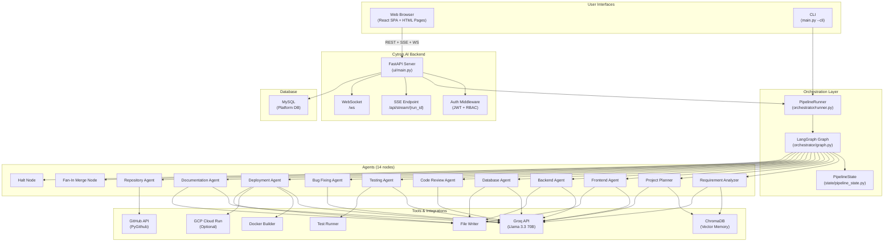
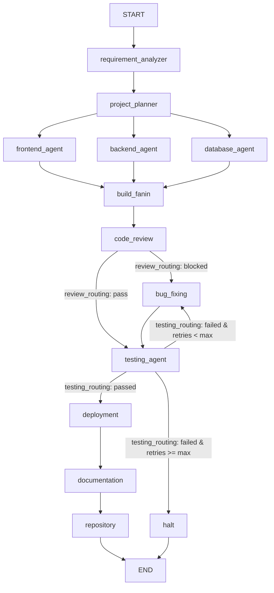
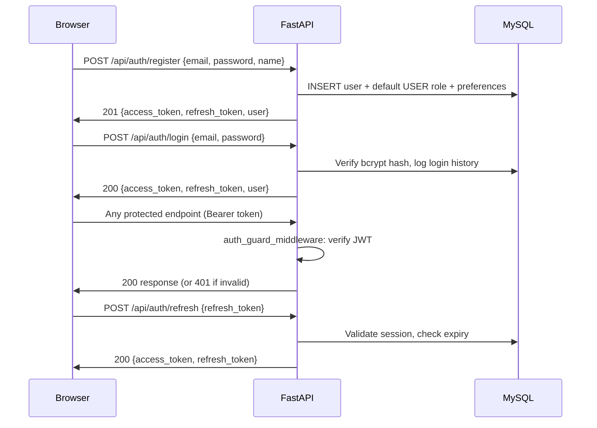
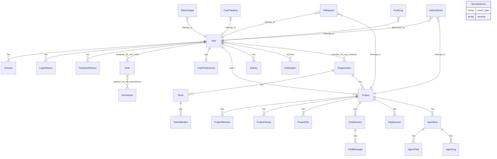

# Cytron.AI

> **Multi-Agent Software Engineering Platform** — describe any web application in plain English and a coordinated pipeline of AI agents will analyze requirements, architect, generate, test, review, fix, document, and optionally deploy it automatically.
 
[](https://python.org)
[](https://fastapi.tiangolo.com)
[](https://react.dev)
[](https://github.com/langchain-ai/langgraph)
[](https://groq.com)
[](https://www.typescriptlang.org)s
[](LICENSE)

---

## Table of Contents

1. [Overview](#overview)
2. [Why Cytron.AI](#why-cytronai)
3. [Core Capabilities](#core-capabilities)
4. [How Cytron.AI Works](#how-cytronai-works)
5. [End-to-End Workflow](#end-to-end-workflow)
6. [System Architecture](#system-architecture)
7. [Multi-Agent Architecture](#multi-agent-architecture)
8. [Agent Responsibilities](#agent-responsibilities)
9. [Orchestration and Agent Coordination](#orchestration-and-agent-coordination)
10. [AI / LLM Architecture](#ai--llm-architecture)
11. [Shared State and Context Management](#shared-state-and-context-management)
12. [Code Generation Pipeline](#code-generation-pipeline)
13. [Code Review](#code-review)
14. [Automated Testing](#automated-testing)
15. [Bug Detection and Automated Fixing](#bug-detection-and-automated-fixing)
16. [Deployment](#deployment)
17. [Documentation Generation](#documentation-generation)
18. [GitHub / Repository Integration](#github--repository-integration)
19. [Authentication and Authorization](#authentication-and-authorization)
20. [Admin Platform](#admin-platform)
21. [Hub — User Workspace](#hub--user-workspace)
22. [History, Events, and Audit Logs](#history-events-and-audit-logs)
23. [Notifications and Real-Time Updates](#notifications-and-real-time-updates)
24. [Core Platform Modules](#core-platform-modules)
25. [Frontend Architecture (Cytron.AI UI)](#frontend-architecture-cytronai-ui)
26. [Backend Architecture](#backend-architecture)
27. [API Overview](#api-overview)
28. [Data Model](#data-model)
29. [Security Architecture](#security-architecture)
30. [Error Handling and Reliability](#error-handling-and-reliability)
31. [Technology Stack](#technology-stack)
32. [Repository Structure](#repository-structure)
33. [Prerequisites](#prerequisites)
34. [Installation](#installation)
35. [Environment Configuration](#environment-configuration)
36. [Running the Application](#running-the-application)
37. [Running the Tests](#running-the-tests)
38. [Generating an Application](#generating-an-application)
39. [Generated Project Structure](#generated-project-structure)
40. [Example Workflow](#example-workflow)
41. [Troubleshooting](#troubleshooting)
42. [Limitations and Known Constraints](#limitations-and-known-constraints)
43. [Roadmap](#roadmap)
44. [Contributing](#contributing)
45. [License](#license)

---

## Overview

### Simple Explanation

Cytron.AI is a platform that takes your plain-English description of a software project and automatically builds it. You describe what you want to make — say, "a task management app with user authentication, team roles, and a dashboard" — and a coordinated team of AI agents gets to work:

- One agent figures out exactly what you want to build
- Another agent designs the full technical architecture
- Three agents simultaneously generate the frontend UI, backend API, and database schema
- An agent reviews all the generated code for bugs and security issues
- Tests are written and executed automatically
- If tests fail, a dedicated agent analyzes the failures and applies targeted code fixes
- The fixed code is tested again — up to 3 times by default
- Infrastructure files (Docker Compose, CI/CD pipelines) are generated
- If GCP credentials are configured, the app is deployed to Google Cloud Run
- A documentation agent writes a full README, API reference, and setup guide
- If GitHub credentials are configured, the code is pushed to a new repository

The result is a working, tested, documented software project in your `output/` directory.

### Technical Explanation

Cytron.AI is a stateful multi-agent orchestration system built on **LangGraph** (a directed cyclic graph framework for LLM workflows). Each agent is a discrete LangGraph node that reads from and writes to a shared **PipelineState** TypedDict. The pipeline supports parallel fan-out for concurrent code generation and conditional routing for retry loops. Agents call **Llama 3.3 70B** (via the Groq API) using structured JSON prompts via **LangChain Groq**. Intermediate artifacts are also stored in **ChromaDB** for cross-agent retrieval. The web platform is a **FastAPI** server with Server-Sent Events (SSE) for real-time streaming and WebSockets for live admin and user notifications. The React 19 + TypeScript + Tailwind CSS v4 frontend provides authentication, user onboarding, admin management, and a workspace hub served from the same origin.

---

## Why Cytron.AI

Software development involves enormous amounts of repetitive, structured work that follows predictable patterns: analyze requirements → design architecture → scaffold code → wire APIs → write tests → fix bugs → document → deploy. This is exactly the kind of work that LLM-based agents can accelerate.

Cytron.AI addresses several real engineering problems:

| Problem                          | Cytron.AI Solution                                                         |
| -------------------------------- | -------------------------------------------------------------------------- |
| Requirements to code translation | Requirement Analyzer agent extracts structured specs from natural language |
| Software architecture decisions  | Project Planner agent produces API contracts, data models, page structure  |
| Repetitive project scaffolding   | Frontend, Backend, Database agents generate complete scaffolded projects   |
| Coordinating multiple code areas | LangGraph orchestrates parallel and sequential agent work                  |
| Automated code quality gates     | Code Review agent combines static Python analysis + LLM review             |
| Test writing is time-consuming   | Testing agent generates and executes pytest suites automatically           |
| Bug discovery and fixing         | Failure enrichment + Bug Fixing agent applies targeted patches             |
| Documentation debt               | Documentation agent generates README, API reference, architecture docs     |
| Repository setup                 | Repository agent creates and populates a GitHub repository                 |
| CI/CD and containerization       | Deployment agent generates Docker Compose + GitHub Actions workflows       |

---

## Core Capabilities

### 1. Requirement Analysis

Transforms a natural-language description into a structured `RequirementSpec` (JSON) containing: `app_name`, `app_type`, `features`, `user_roles`, `workflows`, `data_entities`, and `non_functional` requirements. The spec is persisted to ChromaDB for downstream agent retrieval.

### 2. Project Planning

Consumes the structured spec and produces a `ProjectPlan` containing: technology stack, page/route structure, API contracts (endpoint specifications), and data model definitions. Used by all three parallel build agents.

### 3. Parallel Code Generation

Three agents (Frontend, Backend, Database) run concurrently:

- **Frontend Agent** — generates a React + TypeScript + Tailwind CSS + ShadCN UI application
- **Backend Agent** — generates a FastAPI + SQLAlchemy + Alembic Python application
- **Database Agent** — generates schema files, SQL migrations, and ORM models

### 4. Automated Code Review

Reviews generated backend and database code using a two-layer system:

- **Static analysis** (Python AST/pattern-based, via `PythonAnalyzer`)
- **LLM review** (Llama 3.3 security, style, maintainability review)

HIGH severity issues block pipeline progression and route to bug fixing.

### 5. Test Generation and Execution

Generates pytest test files targeting the FastAPI backend, then executes them in an isolated environment using `test_runner`. Failures are enriched with relevant source code and routed to the bug fixer.

### 6. Automated Bug Fixing

Consumes failure reports and HIGH severity code review issues. Produces targeted snippet-level patches (not full file rewrites) using the LLM. Applies patches and triggers a re-test cycle. Supports up to `MAX_RETRY_CYCLES` (default: 3) iterations.

### 7. Infrastructure Generation

Generates `docker-compose.yml`, GitHub Actions CI/CD workflows, and optionally Kubernetes manifests. Uses the tech registry to produce framework-specific configurations.

### 8. Optional GCP Deployment

When GCP credentials are configured: builds Docker images, pushes to Artifact Registry, and deploys to Cloud Run. Gracefully skips if GCP is not configured.

### 9. Documentation Generation

Produces `README.md`, `API_REFERENCE.md`, `SETUP.md`, and `ARCHITECTURE.md` for the **generated application** — not for Cytron.AI itself.

### 10. GitHub Repository Creation

Pushes the complete generated project to a new GitHub repository via the PyGithub library. Non-blocking if `GITHUB_TOKEN` is not configured.

### 11. Web Platform

Full authentication, onboarding, admin panel, workspace hub, history/event tracking, and real-time progress streaming via SSE and WebSockets.

### 12. Standalone Module APIs

Each major capability is also available as a standalone REST API (requirement analysis, code generation, code review, database schema, system design, test case generation, SQL generation, documentation generation).

---

## How Cytron.AI Works

```
User (Web UI or CLI)
        │
        ▼ plain-English requirement
┌─────────────────────┐
│ Requirement Analyzer│  → RequirementSpec (features, roles, entities, workflows)
└─────────────────────┘
        │
        ▼
┌─────────────────────┐
│   Project Planner   │  → ProjectPlan (stack, pages, API contracts, data model)
└─────────────────────┘
        │
   ┌────┼────┐  (parallel fan-out)
   ▼    ▼    ▼
Frontend Backend Database
Agent  Agent  Agent
   └────┼────┘  (fan-in merge)
        │
        ▼
┌─────────────────────┐
│    Code Review      │──── BLOCKED? ──→ Bug Fixing Agent
└─────────────────────┘                        │
        │ pass                                 │
        ▼                                      │
┌─────────────────────┐ ←────────────────────┘
│   Testing Agent     │──── FAILED + retries < max? ──→ Bug Fixing Agent
└─────────────────────┘                                        │
        │ passed                                               │
        ▼                             ┌────────────────────────┘
┌─────────────────────┐      (retries ≥ max → halt node)
│  Deployment Agent   │  → Infra files, Docker images, GCP Cloud Run (optional)
└─────────────────────┘
        │
        ▼
┌─────────────────────┐
│ Documentation Agent │  → README.md, API_REFERENCE.md, SETUP.md, ARCHITECTURE.md
└─────────────────────┘
        │
        ▼
┌─────────────────────┐
│  Repository Agent   │  → GitHub repository (optional)
└─────────────────────┘
        │
        ▼
       END
```

---

## End-to-End Workflow

The actual workflow is defined in `orchestrator/graph.py`. It follows this execution sequence:

| Step | Agent/Node             | Description                                    | Parallel?      | Conditional?                                |
| ---- | ---------------------- | ---------------------------------------------- | -------------- | ------------------------------------------- |
| 1    | `requirement_analyzer` | Parse natural-language → structured spec       | No             | No                                          |
| 2    | `project_planner`      | Spec → plan (stack, API contracts, data model) | No             | No                                          |
| 3a   | `frontend_agent`       | Generate React + TS + Tailwind frontend        | Yes (parallel) | No                                          |
| 3b   | `backend_agent`        | Generate FastAPI + SQLAlchemy backend          | Yes (parallel) | No                                          |
| 3c   | `database_agent`       | Generate schema, SQL, migrations               | Yes (parallel) | No                                          |
| 4    | `build_fanin`          | Fan-in merge after parallel build              | No             | No                                          |
| 5    | `code_review`          | Static + LLM code review                       | No             | Yes → routes to `bug_fixing` if blocked     |
| 6    | `testing_agent`        | Generate + execute pytest tests                | No             | Yes → routes based on pass/fail/retry limit |
| 7    | `bug_fixing`           | LLM snippet-level patch + apply                | No             | No (loops back to `testing_agent`)          |
| 8    | `deployment`           | Generate infra + optionally deploy to GCP      | No             | No                                          |
| 9    | `documentation`        | Generate docs for generated app                | No             | No                                          |
| 10   | `repository`           | Push to GitHub (optional)                      | No             | No                                          |
| —    | `halt`                 | Terminal error node when retries exhausted     | No             | Terminal                                    |

### Retry Loop Detail

```
testing_agent
    │
    ├── passed → deployment
    ├── failed AND retry_count < max_retries → bug_fixing → testing_agent (loop)
    └── failed AND retry_count ≥ max_retries → halt (error terminal)
```

The default `max_retries` is 3 (configurable via `MAX_RETRY_CYCLES`). The halt node records remaining failures and marks the pipeline state with `should_halt=True`.

---

## System Architecture



---

## Multi-Agent Architecture

Cytron.AI implements **14 distinct agent nodes** in the LangGraph pipeline. The table below documents each one based on the actual implementation.

| Agent                | File                             | Stage        | Parallel? | LLM? | Static Analysis?  |
| -------------------- | -------------------------------- | ------------ | --------- | ---- | ----------------- |
| Requirement Analyzer | `agents/requirement_analyzer.py` | 1            | No        | ✅   | No                |
| Project Planner      | `agents/project_planner.py`      | 2            | No        | ✅   | No                |
| Frontend Agent       | `agents/frontend_agent.py`       | 3 (parallel) | ✅        | ✅   | No                |
| Backend Agent        | `agents/backend_agent.py`        | 3 (parallel) | ✅        | ✅   | No                |
| Database Agent       | `agents/database_agent.py`       | 3 (parallel) | ✅        | ✅   | No                |
| Build Fan-In         | `orchestrator/graph.py`          | 4            | No        | No   | No (merge node)   |
| Code Review Agent    | `agents/code_review_agent.py`    | 5            | No        | ✅   | ✅ PythonAnalyzer |
| Testing Agent        | `agents/testing_agent.py`        | 6            | No        | ✅   | No                |
| Bug Fixing Agent     | `agents/bug_fixing_agent.py`     | 7 (loop)     | No        | ✅   | No                |
| Deployment Agent     | `agents/deployment_agent.py`     | 8            | No        | ✅   | No                |
| Documentation Agent  | `agents/documentation_agent.py`  | 9            | No        | ✅   | No                |
| Repository Agent     | `agents/repository_agent.py`     | 10           | No        | No   | No (API call)     |
| Halt Node            | `orchestrator/graph.py`          | Terminal     | No        | No   | No                |

> **Note:** The `sql_query_agent.py` and `system_design_agent.py` files in `agents/` serve as connectors to the standalone module APIs (`modules/sql_query_generator` and `modules/system_design`). They are not nodes in the primary pipeline graph but are used by the hub modules.

---

## Agent Responsibilities

### Requirement Analyzer (`agents/requirement_analyzer.py`)

**Purpose:** Parse natural-language application requirements into a structured specification.

**Input:** `user_input` (raw string from PipelineState)

**Output:** `structured_spec` (RequirementSpec TypedDict)

**Process:**

1. Calls Llama 3.3 70B with a structured JSON schema prompt
2. Validates and slugifies the `app_name` field (lowercase, underscore-separated, max 40 chars)
3. Persists the spec to ChromaDB under the project's collection for downstream agent retrieval

**Failure behavior:** Sets `should_halt=True` if input is empty or LLM fails. Non-halting errors are appended to the `errors` list.

**RequirementSpec output fields:**

- `app_name` — snake_case slug used as output directory name
- `app_type` — `crud`, `dashboard`, `ecommerce`, `blog`, `saas`, or `other`
- `features` — list of feature strings
- `user_roles` — list of role names
- `workflows` — list of `{name, steps[]}` dicts
- `data_entities` — list of entity names
- `non_functional` — dict of `{performance, security, scalability}`
- `clarifying_questions` — populated if requirements are ambiguous (currently detected but not blocking the pipeline flow)

---

### Project Planner (`agents/project_planner.py`)

**Purpose:** Produce a detailed technical plan from the structured specification.

**Input:** `structured_spec` from PipelineState

**Output:** `project_plan` (ProjectPlan TypedDict)

**Process:**

1. Calls Llama 3.3 70B with the spec and a detailed JSON schema
2. Technology decisions use the StackConfig defaults (React, FastAPI, SQLite/PostgreSQL/MySQL, SQLAlchemy, Alembic, JWT)
3. Produces `pages`, `api_contracts`, `data_model`, and per-agent `frontend_tasks`, `backend_tasks`, `database_tasks`
4. Persists the plan to ChromaDB

**ProjectPlan output fields:**

- `architecture` — `monolith` or `modular_api`
- `stack` — full StackConfig dict (framework choices, ORM, auth strategy, cloud provider)
- `pages` — list of `{name, route, description, components[], requires_auth}`
- `api_contracts` — list of `{method, path, description, request_body, response_schema, auth_required, tags[]}`
- `data_model` — list of `{entity, table, fields[], relationships[]}`
- `project_dir` — absolute path to `output/<app_name>/`

---

### Frontend Agent (`agents/frontend_agent.py`)

**Purpose:** Generate a complete React + TypeScript + Tailwind CSS + ShadCN UI frontend.

**Input:** `project_plan` (pages, API contracts, stack)

**Output:** `frontend_code` (CodeArtifact with `files` dict of `{relative_path: content}`)

**Generated content:**

- `package.json` with React + TypeScript + Tailwind + ShadCN dependencies
- `src/App.tsx` with routing (React Router)
- Per-page components for every page in the project plan
- API client functions for every API contract
- Authentication context/hook if JWT auth is specified
- `Dockerfile` for containerization
- `vite.config.ts`, `tsconfig.json`, `index.html`

**Framework used in tech registry:** Multiple frontend options are registered (React, Vue, Angular, Svelte, SvelteKit, Next.js, etc.) and selected based on user input parsing, falling back to `React` if not specified.

---

### Backend Agent (`agents/backend_agent.py`)

**Purpose:** Generate a complete FastAPI Python backend.

**Input:** `project_plan` (API contracts, data model, stack)

**Output:** `backend_code` (CodeArtifact)

**Generated content:**

- `main.py` — FastAPI app with CORS and router registration
- `requirements.txt`
- Per-resource router files (`routers/<resource>.py`)
- Pydantic schema models (`schemas/<resource>.py`)
- SQLAlchemy models (`models.py`)
- Authentication utilities if JWT auth is required
- `Dockerfile` for containerization
- Alembic migration setup

**Framework used in tech registry:** Multiple backend options are registered (FastAPI, Django, Flask, NestJS, Express, Spring Boot, etc.) and selected based on user input.

---

### Database Agent (`agents/database_agent.py`)

**Purpose:** Generate database schema files, SQL, and ORM models.

**Input:** `project_plan` (data model, stack)

**Output:** `database_schema` (CodeArtifact)

**Generated content:**

- SQLAlchemy model definitions
- Alembic migration files
- `schema.sql` with `CREATE TABLE` statements
- `seed.sql` for initial data if applicable
- Support for PostgreSQL, MySQL, and SQLite

---

### Code Review Agent (`agents/code_review_agent.py`)

**Purpose:** Review all generated backend and database code.

**Input:** `backend_code` and `database_schema` files from PipelineState

**Output:** `review_results` (ReviewResult TypedDict)

**Two-layer review process:**

1. **Static analysis** via `PythonAnalyzer` from `modules/code_review/analyzer.py`:
   - AST and pattern-based Python analysis
   - Detects security issues (e.g., SQL injection patterns, hardcoded credentials)
   - Detects syntax and logic errors
   - Severity levels: `critical`, `high`, `medium`, `low`

2. **LLM review** via Llama 3.3 70B:
   - Reviews code for security vulnerabilities, style issues, maintainability problems
   - Receives static analysis findings to avoid duplication
   - Temperature: 0.1 (deterministic review)

**Blocking logic:** `blocked=True` if any HIGH or CRITICAL severity issues exist in either layer. Blocked state routes to Bug Fixing Agent.

**Review issue fields:**

- `file` — relative file path
- `issue_type` — `security | style | maintainability | correctness`
- `description` — what the issue is
- `severity` — `HIGH | MEDIUM | LOW`
- `suggestion` — how to fix it

---

### Testing Agent (`agents/testing_agent.py`)

**Purpose:** Generate pytest test files and execute them against the backend.

**Input:** `project_plan` (API contracts, auth strategy) and `backend_code`

**Output:** `test_results` (TestResult TypedDict)

**Process:**

1. Calls Llama 3.3 70B to generate `tests/conftest.py` and `tests/test_<resource>.py` files
2. Generated tests use `TestClient` or `httpx.AsyncClient`, SQLite in-memory test DB, and per-test fixtures
3. Writes test files to `output/<app_name>/backend/tests/`
4. Executes via `tools/test_runner.py` (`run_pytest()`)
5. Parses pass/fail results and enriches failures with relevant source snippets

**Test file requirements enforced by prompt:**

- `conftest.py` with SQLite override for `get_db` dependency
- At least one happy path + one error case per endpoint
- Auth tests if JWT is enabled
- No reliance on external services

**Routing:** `testing_routing()` function routes to `deployment` (pass), `bug_fixing` (fail + retries available), or `halt` (max retries exceeded).

---

### Bug Fixing Agent (`agents/bug_fixing_agent.py`)

**Purpose:** Apply targeted fixes to failing code.

**Input:** `test_results` (failures), `review_results` (HIGH issues), `backend_code`, `database_schema`

**Output:** Updated `backend_code` and/or `database_schema` with patches applied; incremented `retry_count`

**Process:**

1. Gathers relevant source snippets for each failing test (up to 5 failures per cycle)
2. Calls Llama 3.3 70B with failures, source context, and HIGH severity review issues
3. LLM returns a list of `{file, component, original_snippet, fixed_snippet, explanation}` patches
4. `_apply_patch()` performs exact string replacement of `original_snippet` → `fixed_snippet`
5. Patched files are written to disk and the `CodeArtifact` in state is updated
6. `retry_count` is incremented

**Max retries:** The Testing Agent checks `retry_count >= max_retries` and routes to `halt` when exhausted.

**Patch failure behavior:** If `original_snippet` cannot be found in the file (snippet drift), the patch is skipped with a warning log rather than failing the entire cycle.

---

### Deployment Agent (`agents/deployment_agent.py`)

**Purpose:** Generate infrastructure files and optionally deploy to GCP.

**Input:** `project_plan`, `frontend_code`, `backend_code`, `user_input`

**Output:** `deployment_info` (DeploymentInfo TypedDict)

**Process:**

1. Parses the tech stack from user input via `tech_registry.parse_tech_stack()`
2. Calls Llama 3.3 70B with a framework-aware prompt to generate:
   - `docker-compose.yml` (backend, frontend, database services with healthchecks)
   - `.github/workflows/ci-cd.yml` (GitHub Actions: test → build → push → deploy)
   - `.env.production.example`
3. Writes infra files to `output/<app_name>/infra/`
4. **If `GCP_PROJECT_ID` is set:** builds Docker images via `tools/docker_builder.py`, pushes to Artifact Registry, deploys to Cloud Run via `tools/cloud_deployer.py`
5. **If GCP is not configured:** skips cloud steps and sets URLs to `localhost:3000/8000 (docker-compose)`

**DeploymentInfo output fields:**

- `app_url` — live URL or `http://localhost:3000`
- `deployment_id` — unique ID
- `cloud_provider` — `gcp` or `local`
- `docker_images` — list of pushed image tags
- `infra_artifacts` — dict mapping filename → local path

---

### Documentation Agent (`agents/documentation_agent.py`)

**Purpose:** Generate developer-friendly documentation for the **generated application**.

**Input:** `project_plan`, `structured_spec`, `deployment_info`, `repo_url`

**Output:** `docs` (Documentation TypedDict) + files written to `output/<app_name>/docs/`

**Generated files (for the generated app, not for Cytron.AI):**

- `README.md` — project overview, features, quick start, tech stack, contributing
- `docs/API_REFERENCE.md` — per-endpoint documentation with curl examples
- `docs/SETUP.md` — prerequisites, docker-compose steps, environment variables
- `docs/ARCHITECTURE.md` — architecture overview with Mermaid sequence diagrams

**Fallback:** If the LLM fails, a minimal `README.md` is written with an error note.

---

### Repository Agent (`agents/repository_agent.py`)

**Purpose:** Create and populate a GitHub repository for the generated project.

**Input:** `project_plan`, `structured_spec`, `docs`

**Output:** `repo_url` (string or None)

**Process:** Uses PyGithub (`tools/github_tool.py`) to:

1. Create a new repository (public or private) under the configured org or user
2. Commit all generated files from the project directory

**Non-blocking:** If `GITHUB_TOKEN` is empty in `.env`, this step is skipped gracefully and `repo_url` is `None`. The pipeline completes successfully.

---

## Orchestration and Agent Coordination

Cytron.AI uses **LangGraph** (v0.2+) for agent orchestration.

### Graph Topology



### Key LangGraph Concepts Used

| Concept                   | Usage                                                                                 |
| ------------------------- | ------------------------------------------------------------------------------------- |
| `StateGraph`              | Wraps `PipelineState` TypedDict — all nodes share this state                          |
| `add_node()`              | Registers each agent as an async-capable node                                         |
| `add_edge()`              | Sequential deterministic transitions                                                  |
| `add_conditional_edges()` | Routing based on `review_routing()` and `testing_routing()` return values             |
| `MemorySaver`             | In-memory checkpointing for state persistence across interruptions                    |
| Parallel fan-out          | Three `add_edge()` calls from `project_planner` to three build agents                 |
| Annotated reducers        | `_keep_last`, `_merge_lists`, `_merge_dicts` used on fields written by parallel nodes |
| `astream()`               | Async streaming of node outputs for real-time UI updates                              |

### State Reducers for Parallel Nodes

Because `frontend_agent`, `backend_agent`, and `database_agent` run concurrently and all write to `stage`, `errors`, and `agent_logs`, LangGraph requires merge reducers for those fields:

- `stage` — last-writer-wins (`_keep_last`)
- `errors` — list concatenation (`_merge_lists`)
- `agent_logs` — dict merge (`_merge_dicts`)

---

## AI / LLM Architecture

### Provider and Model

| Setting        | Value                                                     |
| -------------- | --------------------------------------------------------- |
| Provider       | Groq                                                      |
| Model          | `llama-3.3-70b-versatile` (configurable via `GROQ_MODEL`) |
| Library        | `langchain-groq` (`ChatGroq`)                             |
| Authentication | `GROQ_API_KEY`                                            |

### Agent-Specific LLM Configuration

| Agent                | Temperature | max_retries | Strategy                       |
| -------------------- | ----------- | ----------- | ------------------------------ |
| Requirement Analyzer | 0.2         | 2           | Structured JSON extraction     |
| Project Planner      | (default)   | 2           | Structured JSON planning       |
| Frontend Agent       | (default)   | 2           | Code generation                |
| Backend Agent        | (default)   | 2           | Code generation                |
| Database Agent       | (default)   | 2           | Schema generation              |
| Code Review Agent    | 0.1         | 2           | Deterministic security review  |
| Testing Agent        | 0.1         | 2           | Deterministic test generation  |
| Bug Fixing Agent     | 0.1         | 2           | Targeted patch generation      |
| Deployment Agent     | 0.1         | 2           | Infrastructure templating      |
| Documentation Agent  | 0.3         | 2           | Creative documentation writing |

### Prompt Architecture

All agents use a two-message structure:

1. `SystemMessage` — role definition, output schema (JSON), generation rules
2. `HumanMessage` — specific context (requirements, code, failures, etc.)

All agents are instructed to **respond with valid JSON only** — no markdown fences, no prose. JSON parsing uses `tools/json_parser.py` which wraps `json-repair` for LLM response tolerance.

### Vector Memory (ChromaDB)

ChromaDB is used for cross-agent context retrieval:

- The Requirement Analyzer and Project Planner store their outputs as embeddings
- Each project gets its own named collection (e.g., `todo_app`)
- Agents can retrieve relevant context via `tools/chroma_store.retrieve_context()`
- ChromaDB can run in **local PersistentClient** mode (default, file-based at `CHROMA_PATH`) or **cloud mode** (`CHROMA_API_KEY` configured)

---

## Shared State and Context Management

The `PipelineState` TypedDict (`state/pipeline_state.py`) is the single shared data structure for the entire pipeline.

### State Fields

| Field             | Type                            | Writer                  | Description                           |
| ----------------- | ------------------------------- | ----------------------- | ------------------------------------- |
| `user_input`      | `str`                           | Initial                 | Raw natural-language requirement      |
| `structured_spec` | `RequirementSpec`               | Requirement Analyzer    | Parsed application specification      |
| `project_plan`    | `ProjectPlan`                   | Project Planner         | Full technical plan                   |
| `frontend_code`   | `CodeArtifact`                  | Frontend Agent          | Frontend files dict                   |
| `backend_code`    | `CodeArtifact`                  | Backend + Bug Fixer     | Backend files dict (patched in-place) |
| `database_schema` | `CodeArtifact`                  | Database + Bug Fixer    | DB files dict (patched in-place)      |
| `review_results`  | `ReviewResult`                  | Code Review             | Issues list + blocked flag            |
| `test_results`    | `TestResult`                    | Testing Agent           | Pass/fail + failures list             |
| `deployment_info` | `DeploymentInfo`                | Deployment Agent        | URLs, images, infra paths             |
| `docs`            | `Documentation`                 | Documentation Agent     | Generated doc files                   |
| `repo_url`        | `str \| None`                   | Repository Agent        | GitHub repository URL                 |
| `stage`           | `Annotated[str, _keep_last]`    | All agents              | Current pipeline stage label          |
| `should_halt`     | `Annotated[bool, _keep_last]`   | Orchestrator / agents   | Abort signal                          |
| `retry_count`     | `int`                           | Bug Fixing Agent        | Bug-fix iteration counter             |
| `max_retries`     | `int`                           | Initial (from settings) | Maximum allowed retry cycles          |
| `errors`          | `Annotated[list, _merge_lists]` | All agents              | Accumulated non-fatal errors          |
| `agent_logs`      | `Annotated[dict, _merge_dicts]` | All agents              | Per-agent structured logs             |

---

## Code Generation Pipeline

### Generated Frontend Stack

| Layer       | Technology                                    |
| ----------- | --------------------------------------------- |
| Framework   | React (18/19, configurable via tech registry) |
| Language    | TypeScript                                    |
| Styling     | Tailwind CSS + ShadCN UI                      |
| Bundler     | Vite                                          |
| Routing     | React Router                                  |
| State       | Context/hooks (simple apps)                   |
| HTTP client | fetch (generated API client functions)        |
| Container   | Dockerfile (nginx for production)             |

**Tech registry alternatives** (parsed from user input or defaults to React):
Vue.js, Angular, Svelte, SvelteKit, Next.js, Nuxt.js, Astro, and others.

### Generated Backend Stack

| Layer      | Technology                                                                         |
| ---------- | ---------------------------------------------------------------------------------- |
| Framework  | FastAPI (default), Django, Flask, NestJS, Express, Spring Boot (via tech registry) |
| Language   | Python (FastAPI/Django/Flask) or Node.js (Express/NestJS)                          |
| ORM        | SQLAlchemy (Python backends)                                                       |
| Migrations | Alembic (Python backends)                                                          |
| Auth       | JWT (default), session, or none                                                    |
| Validation | Pydantic v2                                                                        |
| Container  | Dockerfile (uvicorn/gunicorn for Python, node for JS)                              |

### Generated Database Stack

| Database   | Support                                       |
| ---------- | --------------------------------------------- |
| PostgreSQL | ✅ Full                                       |
| MySQL      | ✅ Full                                       |
| SQLite     | ✅ Full (default, no external service needed) |
| MongoDB    | ❌ Not supported                              |

---

## Code Review

The Code Review Agent (`agents/code_review_agent.py`) implements a two-layer review:

### Layer 1: Static Analysis (`modules/code_review/analyzer.py`)

- `PythonAnalyzer` class performs deterministic AST and regex-based analysis
- `determine_language()` detects Python files from file paths/content
- Categories: `security`, `syntax`, `logic`, `style`
- Severity: `critical`, `high`, `medium`, `low`
- Findings are converted to the standard issue format before LLM review

### Layer 2: LLM Review

- Receives a truncated view of all files (max 800 chars per file, 6000 total chars)
- Receives existing static analysis findings to avoid duplication
- Produces issues categorized as `security | style | maintainability | correctness`
- Temperature: 0.1 for deterministic output

### Blocking Conditions

`blocked=True` is set if:

- Any `HIGH` or `CRITICAL` severity static analysis issue exists
- The LLM sets `"blocked": true` in its JSON response (which it should only do for SQL injection, hardcoded secrets, missing auth on protected endpoints, or core logic errors)

A `blocked=True` state routes the pipeline to the Bug Fixing Agent instead of the Testing Agent.

---

## Automated Testing

The Testing Agent (`agents/testing_agent.py`) integrates test generation with execution:

### Test Generation

The LLM generates:

- `tests/conftest.py` — SQLite in-memory override for `get_db`, `TestClient` fixture
- `tests/test_<resource>.py` — happy path + error case per endpoint, auth tests if enabled

### Test Execution

`tools/test_runner.py` (`run_pytest()`) executes tests in an isolated environment within the backend output directory. Returns structured `{passed, total, passed_count, failed_count, failures[]}`.

### Failure Enrichment

Each failure is enriched with `relevant_source_snippet` — up to 2000 characters of the most likely related source file — using a heuristic match on test file name → router file name.

---

## Bug Detection and Automated Fixing

### Complete Remediation Loop

```
1. Testing Agent runs tests
        ↓
2. Failures detected: [{test_name, file, error_message, relevant_source_snippet}]
        ↓
3. Bug Fixing Agent receives: failures (up to 5) + source snippets + HIGH review issues
        ↓
4. LLM produces: [{file, component, original_snippet, fixed_snippet, explanation}]
        ↓
5. _apply_patch() replaces original_snippet with fixed_snippet in memory
        ↓
6. Patched files written to disk (output/<app_name>/backend/ or database/)
        ↓
7. State updated: backend_code and/or database_schema with patched files
        ↓
8. retry_count incremented
        ↓
9. Testing Agent re-runs → evaluates new state
        ↓
10a. Tests pass → continue to Deployment
10b. Tests still fail AND retry_count < max_retries → loop back to Bug Fixing
10c. Tests still fail AND retry_count >= max_retries → Halt (max retries exceeded)
```

**Configuration:** `MAX_RETRY_CYCLES=3` (default). Set in `.env` or passed at runtime.

**When halt is triggered:** The pipeline records remaining failures and errors in state, then terminates with a structured error response. Manual intervention is required.

---

## Deployment

The Deployment Agent (`agents/deployment_agent.py`) handles two distinct phases:

### Phase 1: Infrastructure File Generation (Always runs)

Generated regardless of GCP configuration:

- `infra/docker-compose.yml` — three-service config (backend, frontend, database) with healthchecks and environment variable references
- `infra/.github/workflows/ci-cd.yml` — GitHub Actions pipeline: checkout → test → build Docker → push to Artifact Registry → deploy to Cloud Run
- `infra/.env.production.example` — production environment variable template

Infrastructure files are generated using tech-registry-aware prompts that adapt to the selected frontend and backend frameworks.

### Phase 2: GCP Deployment (Only if GCP credentials are configured)

When `GCP_PROJECT_ID` is set:

1. `tools/docker_builder.py` — builds Docker images for backend and frontend
2. Pushes images to GCP Artifact Registry
3. `tools/cloud_deployer.py` — deploys to GCP Cloud Run using the `google-cloud-run` SDK

When GCP is not configured, the agent logs a message and sets the app URL to `http://localhost:3000 (docker-compose)`.

**Run generated apps locally (no GCP needed):**

```bash
cd output/<app_name>
docker-compose up
```

---

## Documentation Generation

The Documentation Agent generates documentation **for the generated application**, not for Cytron.AI.

### Generated Documents

| File                    | Content                                                                           |
| ----------------------- | --------------------------------------------------------------------------------- |
| `README.md`             | Project title, features, quick start, tech stack, contributing section            |
| `docs/API_REFERENCE.md` | Per-endpoint reference with method, path, request/response schemas, curl examples |
| `docs/SETUP.md`         | Prerequisites, docker-compose steps, environment variable descriptions            |
| `docs/ARCHITECTURE.md`  | High-level architecture description with Mermaid sequence diagram                 |

Additionally, `README.md` is copied to the project root (`output/<app_name>/README.md`).

### Standalone Documentation Generator

The `modules/documentation_generator/` module provides a standalone API (`/api/docs/generate`) for generating documentation independently of the pipeline. It supports many additional document types and output formats (see [Core Platform Modules](#core-platform-modules)).

---

## GitHub / Repository Integration

The Repository Agent uses **PyGithub** (`tools/github_tool.py`) to:

1. Create a new GitHub repository (public or private, based on `GITHUB_DEFAULT_VISIBILITY`)
2. Push all files from `output/<app_name>/` as an initial commit

**Configuration required:**

- `GITHUB_TOKEN` — GitHub Personal Access Token with `repo` scope
- `GITHUB_ORG` — Organization name (optional; creates under authenticated user if empty)

**Graceful degradation:** If `GITHUB_TOKEN` is not set, the agent skips repository creation and returns `repo_url=None`. The rest of the pipeline is unaffected.

**Handles existing repositories:** If a repo with the same name already exists (HTTP 422), the agent gets the existing repo URL and continues.

---

## Authentication and Authorization

Cytron.AI implements a full JWT-based authentication system for the web platform.

### Authentication Flow



### JWT Configuration

| Setting                       | Default                            | Description                           |
| ----------------------------- | ---------------------------------- | ------------------------------------- |
| `JWT_SECRET`                  | `eto-agent-secure-secret-key-2026` | Signing key — change in production    |
| `JWT_ALGORITHM`               | `HS256`                            | Signing algorithm                     |
| `ACCESS_TOKEN_EXPIRE_MINUTES` | 30                                 | Access token lifetime                 |
| `REFRESH_TOKEN_EXPIRE_DAYS`   | 7                                  | Refresh token lifetime (stored in DB) |

### Roles

| Role              | Description             | Access                                   |
| ----------------- | ----------------------- | ---------------------------------------- |
| `USER`            | Default registered user | Hub workspace, project generation        |
| `ADMIN`           | Platform administrator  | Admin panel + full user management       |
| `SUPER_ADMIN`     | Elevated administrator  | All admin capabilities + system settings |
| `SUPPORT`         | Support staff           | Admin panel (read + limited actions)     |
| `READ_ONLY_ADMIN` | Read-only admin         | Admin panel (read only)                  |

### RBAC Middleware

`modules/auth/rbac.py` provides:

- `get_current_user` — required auth dependency
- `get_current_user_optional` — optional auth dependency
- `has_role(role)` — role check dependency factory
- `has_permission(permission)` — permission check dependency factory

The `auth_guard_middleware` in `ui/main.py` enforces:

- Normal users visiting `/app` are redirected to `/hub`
- Unauthenticated API requests receive HTTP 401
- Unauthenticated page requests redirect to `/app/#/login`
- Admin endpoints (`/api/admin/`) require admin-level roles (403 otherwise)

### Auth API Endpoints

| Method    | Path                        | Description                 |
| --------- | --------------------------- | --------------------------- |
| POST      | `/api/auth/register`        | Register new user           |
| POST      | `/api/auth/login`           | Login and receive tokens    |
| POST      | `/api/auth/refresh`         | Refresh access token        |
| POST      | `/api/auth/logout`          | Invalidate session          |
| POST      | `/api/auth/forgot-password` | Send reset token            |
| POST      | `/api/auth/reset-password`  | Set new password via token  |
| GET/PATCH | `/api/auth/profile`         | Get/update profile          |
| GET/PATCH | `/api/auth/preferences`     | Get/update user preferences |
| POST      | `/api/auth/api-keys`        | Store external API keys     |

**Password policy:** Minimum 8 characters, requires at least one uppercase, one lowercase, one number.

**Password history:** Previous passwords are stored (hashed) to prevent reuse.

---

## Admin Platform

The admin panel (`modules/admin/router.py`, frontend page `AdminPanel.tsx`) provides complete platform management.

### Admin Dashboard Metrics (`GET /api/admin/dashboard/metrics`)

Real-time system counters:

- **Users:** total, active, suspended, online (active sessions in last 15 min)
- **Projects:** total, currently running, created today
- **AI/LLM:** total requests, tokens consumed, estimated costs, requests today
- **Agents:** running agent tasks, failed agent tasks
- **System:** CPU%, RAM%, disk usage% via `psutil`

### User Management

| Endpoint                                 | Description                                       |
| ---------------------------------------- | ------------------------------------------------- |
| `GET /api/admin/users`                   | Paginated user list with search and status filter |
| `PATCH /api/admin/users/{id}/status`     | Suspend or ban a user                             |
| `POST /api/admin/users/{id}/role`        | Assign a role to a user                           |
| `DELETE /api/admin/users/{id}/role`      | Remove a role from a user                         |
| `POST /api/admin/users/{id}/impersonate` | Generate impersonation token                      |
| `DELETE /api/admin/users/{id}`           | Soft-delete a user                                |

### Organization Management

| Endpoint                                    | Description              |
| ------------------------------------------- | ------------------------ |
| `GET /api/admin/organizations`              | List organizations       |
| `POST /api/admin/organizations`             | Create organization      |
| `PATCH /api/admin/organizations/{id}/quota` | Update storage/AI quotas |

### AI Usage and Cost Tracking

| Endpoint                   | Description                                 |
| -------------------------- | ------------------------------------------- |
| `GET /api/admin/ai/usage`  | Paginated AI request log with filters       |
| `GET /api/admin/ai/costs`  | Aggregated cost breakdown by provider/model |
| `GET /api/admin/ai/tokens` | Token usage over time                       |

### Security and Audit

| Endpoint                         | Description                                     |
| -------------------------------- | ----------------------------------------------- |
| `GET /api/admin/security/events` | Security event log (failed logins, brute force) |
| `GET /api/admin/audit/logs`      | Full audit trail of admin actions               |

### Agent Monitoring

| Endpoint                      | Description                         |
| ----------------------------- | ----------------------------------- |
| `GET /api/admin/agents/tasks` | All agent task statuses and metrics |
| `GET /api/admin/agents/runs`  | All pipeline run summaries          |

### Feature Flags and System Settings

| Endpoint                              | Description                 |
| ------------------------------------- | --------------------------- |
| `GET /api/admin/feature-flags`        | List feature flags          |
| `PATCH /api/admin/feature-flags/{id}` | Enable/disable feature flag |
| `GET /api/admin/system/settings`      | Get system settings         |
| `PATCH /api/admin/system/settings`    | Update system settings      |

### Export

| Endpoint                         | Description            |
| -------------------------------- | ---------------------- |
| `GET /api/admin/export/users`    | Export users as CSV    |
| `GET /api/admin/export/ai-usage` | Export AI usage as CSV |

---

## Hub — User Workspace

The Hub (`modules/hub/router.py`) is the main workspace for normal users. It serves Jinja2 HTML templates and provides REST APIs for real-time dashboard data.

### Hub Pages (server-rendered HTML)

| Route        | Page           | Description                                     |
| ------------ | -------------- | ----------------------------------------------- |
| `/hub`       | Hub Dashboard  | Main workspace with pipeline trigger and status |
| `/agents`    | Agent Monitor  | Real-time agent task telemetry                  |
| `/workflows` | Workflow View  | Pipeline run history and details                |
| `/history`   | History        | History event log                               |
| `/templates` | Templates      | App templates                                   |
| `/settings`  | Settings       | User settings                                   |
| `/states`    | State Showcase | Pipeline state visualization                    |

### Hub REST APIs

| Endpoint                            | Description                                     |
| ----------------------------------- | ----------------------------------------------- |
| `GET /api/hub/agents`               | Agent task list with status, duration, progress |
| `POST /api/hub/agents/{id}/restart` | Signal agent task restart                       |
| `GET /api/hub/workflows`            | Pipeline run list with task breakdown           |
| `GET /api/hub/projects`             | User's project list                             |
| `GET /api/hub/history`              | HistoryEvent log (paginated)                    |
| `GET /api/hub/stack-registry`       | Available frontend/backend/architecture options |

---

## History, Events, and Audit Logs

### Database Models

| Model           | Purpose                                                                         |
| --------------- | ------------------------------------------------------------------------------- |
| `HistoryEvent`  | Tracks agent, user, and system activity events with full lifecycle metadata     |
| `AuditLog`      | Immutable admin action audit trail (login, delete, impersonate, config changes) |
| `ActivityLog`   | User/org/project activity events                                                |
| `SecurityEvent` | Security-relevant events (failed logins, brute force suspects)                  |
| `LoginHistory`  | Per-user login attempt history                                                  |

### HistoryEvent Fields

| Field                                         | Description                                           |
| --------------------------------------------- | ----------------------------------------------------- |
| `activity_type`                               | What happened (e.g., `code_generation`, `deployment`) |
| `action_type`                                 | Who acted: `USER`, `AGENT`, or `SYSTEM`               |
| `agent_name`                                  | Which agent (if agent action)                         |
| `project_name`                                | Associated project                                    |
| `workflow_id` / `execution_id`                | Pipeline run identifiers                              |
| `status`                                      | `QUEUED`, `RUNNING`, `COMPLETED`, `FAILED`, etc.      |
| `started_at` / `completed_at` / `duration_ms` | Timing                                                |
| `files_generated`                             | JSON list of generated file paths                     |
| `error` / `error_code`                        | Error details if failed                               |

### Logging System (`modules/common/logger.py`)

The platform uses a custom structured logging system with:

- **Color-coded ANSI terminal output** (16 distinct log categories)
- **Structured JSON log rotation** to `logs/` directory
- **Non-blocking async queue logging** via background thread
- **Context variable propagation** (`user_id`, `session_id`, `request_id`, `workflow_step`)
- **Performance monitoring** (CPU, RAM metrics via background thread)
- **LLM callback tracking** (token counts, latency, costs)
- **Metrics collector** (`MetricsCollector`) tracking API calls, DB queries, LLM calls, tool usage

Log levels/categories: `INFO`, `SUCCESS`, `WARNING`, `ERROR`, `CRITICAL`, `STARTUP`, `SYSTEM`, `USER ACTION`, `AGENT ACTION`, `TOOL CALL`, `API CALL`, `DATABASE`, `VECTOR DB`, `CACHE`, `FILE SYSTEM`, `NETWORK`, `SECURITY`

---

## Notifications and Real-Time Updates

### Server-Sent Events (SSE)

Pipeline progress is streamed to the browser via SSE:

| Endpoint                   | Description                                    |
| -------------------------- | ---------------------------------------------- |
| `POST /api/run`            | Start pipeline, returns `{run_id, stream_url}` |
| `GET /api/stream/{run_id}` | SSE stream of pipeline events                  |
| `GET /api/status/{run_id}` | Current run status                             |
| `GET /api/runs`            | List recent runs (last 20)                     |

**Event format:**

```json
{
  "type": "progress | complete | error | file_update",
  "stage": "stage_name",
  "label": "Human-readable label",
  "data": { ... }
}
```

`file_update` events are emitted as new files appear in the output directory, with file type detection.

### WebSockets

`modules/notifications/websocket.py` provides a WebSocket manager with three connection types:

| Client Type | Query Param              | Description                                             |
| ----------- | ------------------------ | ------------------------------------------------------- |
| `user`      | `target_id=<user_id>`    | Per-user notification channel                           |
| `admin`     | —                        | Admin panel live feed (broadcasts to all admin sockets) |
| `project`   | `target_id=<project_id>` | Project-specific build updates                          |

**Endpoint:** `GET /ws?client_type=<type>&target_id=<id>&token=<jwt>`

The WebSocket endpoint validates the optional JWT token and maintains typed connection sets. Dead connections are cleaned up automatically on send failure.

---

## Core Platform Modules

### `modules/auth/` — Authentication and RBAC

JWT service, password hashing/verification, session management, API key storage, password history, forgot-password/reset-password flows.

### `modules/admin/` — Administration API

Full platform admin: users, organizations, AI usage, cost tracking, agent monitoring, feature flags, security events, audit logs, export.

### `modules/database/` — Platform Database Layer

SQLAlchemy models, connection setup, database initialization, seed scripts.

### `modules/hub/` — User Workspace

Hub pages (Jinja2), agent telemetry API, workflow history API, project list API, stack registry API.

### `modules/common/` — Shared Utilities

- `logger.py` — custom structured logging, metrics collector, context variables
- `history.py` — history event helper functions
- `utils.py` — Jinja2 template setup

### `modules/build_complete_project/` — Build Module

- `generator.py` — complete project build endpoint logic and file type detection
- `tech_registry.py` — framework registry (frontend, backend, architecture configs with prompt guidelines and file schemas)
- `router.py` — `POST /api/build/complete` endpoint

### `modules/requirement_analyzer/` — Standalone Requirement API

`POST /api/requirements/analyze` — analyze requirements independently of the pipeline.

### `modules/code_generation/` — Code Generation API

Standalone code generation endpoint.

### `modules/code_review/` — Code Review Module

- `analyzer.py` — `PythonAnalyzer` (static analysis) + `determine_language()`
- `generator.py` — review generation logic
- `router.py` — `POST /api/review/analyze`

### `modules/database_schema/` — Schema Generation API

`POST /api/db-schema/generate` — standalone database schema generation.

### `modules/system_design/` — System Design API

`POST /api/system-design/generate` — standalone HLD/LLD generation.

### `modules/test_case_generator/` — Test Case Generator API

`POST /api/tests/generate` — generate test cases with 35+ framework support, multiple strategies, and export formats.

### `modules/documentation_generator/` — Documentation Generator API

`POST /api/docs/generate` — standalone documentation generation supporting:

- **Document types:** BRD, PRD, SRS, HLD, LLD, README, User Guide, Deployment Guide, API Reference, Test Plan, Security Documentation, CI/CD Documentation, Release Notes, and more
- **Output formats:** Word (.docx), PowerPoint (.pptx), PDF, Draw.io (.drawio), JSON, YAML, XML, Markdown, HTML, Plain Text

### `modules/sql_query_generator/` — SQL Query API

`POST /api/sql/generate` — generate complex SQL queries.

### `modules/notifications/` — WebSocket Manager

Connection manager and WebSocket endpoint for real-time user and admin notifications.

---

## Frontend Architecture (Cytron.AI UI)

> This section describes the Cytron.AI platform's own React frontend, **not** the frontend generated for user applications.

### Technology Stack

| Layer                | Technology               | Version   |
| -------------------- | ------------------------ | --------- |
| Framework            | React                    | 19.x      |
| Language             | TypeScript               | ~6.0      |
| Build tool           | Vite                     | 8.x       |
| Styling              | Tailwind CSS             | v4        |
| State management     | Zustand                  | 5.x       |
| Routing              | React Router v7          | 7.x       |
| HTTP / data fetching | TanStack Query           | 5.x       |
| Tables               | TanStack Table           | 8.x       |
| Forms                | React Hook Form + Zod v4 | 7.x + 4.x |
| Charts               | Recharts                 | 3.x       |
| Animations           | Framer Motion            | 12.x      |
| Icons                | Lucide React             | 1.x       |
| Linter               | OXLint                   | 1.x       |

### Frontend Structure

```
ui/frontend/src/
├── App.tsx              # Root router (HashRouter)
├── main.tsx             # React DOM entry
├── store/
│   └── authStore.ts     # Zustand auth state (access_token, user, roles)
├── components/
│   └── SessionTimer.tsx # JWT session expiry timer + auto-logout
└── pages/
    ├── Login.tsx         # Login form
    ├── Register.tsx      # Registration form
    ├── ForgotPassword.tsx # Password reset request
    ├── ResetPassword.tsx  # Password reset with token
    ├── Onboarding.tsx     # New user onboarding flow
    └── AdminPanel.tsx     # Full admin dashboard (46 KB — tabs, tables, charts)
```

### React Routing

The React SPA uses **HashRouter** and is served at `/app`. Routes:

| Path               | Component      | Auth Required | Role Required                                   |
| ------------------ | -------------- | ------------- | ----------------------------------------------- |
| `/login`           | Login          | No            | —                                               |
| `/register`        | Register       | No            | —                                               |
| `/forgot-password` | ForgotPassword | No            | —                                               |
| `/reset-password`  | ResetPassword  | No            | —                                               |
| `/onboarding`      | Onboarding     | ✅            | USER                                            |
| `/admin`           | AdminPanel     | ✅            | ADMIN / SUPER_ADMIN / SUPPORT / READ_ONLY_ADMIN |
| `/*`               | Redirect       | —             | —                                               |

### Authentication State

Managed by Zustand (`authStore`). The `SessionTimer` component monitors token expiry and triggers automatic logout.

### Server-Rendered Hub Pages

The `/hub`, `/agents`, `/workflows`, `/history`, `/templates`, `/settings` pages are Jinja2 HTML templates served by the FastAPI backend (not part of the React SPA). They interact with the Hub REST APIs and the SSE/WebSocket endpoints.

### Building the Frontend

```bash
cd ui/frontend
npm install
npm run build
# Output goes to ui/static/react/ (served by FastAPI at /app)
```

---

## Backend Architecture

### Entry Point

`ui/main.py` — FastAPI application with:

- Two HTTP middleware layers (auth guard + request logging)
- 12 modular router includes
- SSE pipeline streaming endpoints
- Static file mounting for the React SPA
- Jinja2 template rendering for hub pages

### Router Modules

| Router          | Prefix               | Description                         |
| --------------- | -------------------- | ----------------------------------- |
| Hub             | `/hub`, `/api/hub/*` | Workspace pages and data APIs       |
| Auth            | `/api/auth`          | Authentication and user management  |
| Admin           | `/api/admin`         | Administrative management           |
| Build           | `/api/build`         | Complete project build endpoint     |
| Requirements    | `/api/requirements`  | Standalone requirement analysis     |
| Code Generation | `/api/codegen`       | Standalone code generation          |
| Code Review     | `/api/review`        | Standalone code review              |
| Database Schema | `/api/db-schema`     | Standalone schema generation        |
| System Design   | `/api/system-design` | Standalone HLD/LLD generation       |
| Test Cases      | `/api/tests`         | Standalone test case generation     |
| Documentation   | `/api/docs`          | Standalone documentation generation |
| SQL             | `/api/sql`           | Standalone SQL query generation     |
| WebSocket       | `/ws`                | Real-time notification WebSocket    |

### Database

The platform uses **MySQL** (configurable via `DATABASE_URL`). SQLAlchemy ORM with `SessionLocal` sessions.

**Database initialization:** `modules/database/init_db.py` creates all tables and seeds default roles, admin user, feature flags, and system settings.

### Background Task Pattern

Pipeline runs execute as `asyncio.create_task()` background tasks. The `POST /api/run` endpoint returns immediately with a `run_id` and `stream_url`. The client connects to `GET /api/stream/{run_id}` to receive SSE events.

---

## API Overview

### Pipeline APIs

| Method | Path                   | Auth | Description                 |
| ------ | ---------------------- | ---- | --------------------------- |
| POST   | `/api/run`             | ✅   | Start pipeline run          |
| GET    | `/api/stream/{run_id}` | No   | SSE stream for run progress |
| GET    | `/api/status/{run_id}` | No   | Get run status              |
| GET    | `/api/runs`            | No   | List recent runs            |
| GET    | `/health`              | No   | Health check                |

### Auth APIs

| Method | Path                        | Auth | Description            |
| ------ | --------------------------- | ---- | ---------------------- |
| POST   | `/api/auth/register`        | No   | Register new user      |
| POST   | `/api/auth/login`           | No   | Login                  |
| POST   | `/api/auth/refresh`         | No   | Refresh tokens         |
| POST   | `/api/auth/logout`          | ✅   | Logout                 |
| POST   | `/api/auth/forgot-password` | No   | Request password reset |
| POST   | `/api/auth/reset-password`  | No   | Reset password         |
| GET    | `/api/auth/profile`         | ✅   | Get user profile       |
| PATCH  | `/api/auth/profile`         | ✅   | Update profile         |
| GET    | `/api/auth/preferences`     | ✅   | Get preferences        |
| PATCH  | `/api/auth/preferences`     | ✅   | Update preferences     |
| POST   | `/api/auth/api-keys`        | ✅   | Store API key          |

### Hub APIs

| Method | Path                           | Auth | Description                  |
| ------ | ------------------------------ | ---- | ---------------------------- |
| GET    | `/api/hub/agents`              | ✅   | Agent task telemetry         |
| POST   | `/api/hub/agents/{id}/restart` | ✅   | Restart agent task           |
| GET    | `/api/hub/workflows`           | ✅   | Pipeline run list            |
| GET    | `/api/hub/projects`            | ✅   | User projects                |
| GET    | `/api/hub/history`             | ✅   | History event log            |
| GET    | `/api/hub/stack-registry`      | ✅   | Available tech stack options |

### Module APIs (Standalone)

| Method | Path                          | Auth | Description            |
| ------ | ----------------------------- | ---- | ---------------------- |
| POST   | `/api/requirements/analyze`   | ✅   | Analyze requirements   |
| POST   | `/api/build/complete`         | ✅   | Build complete project |
| POST   | `/api/codegen/generate`       | ✅   | Generate code          |
| POST   | `/api/review/analyze`         | ✅   | Review code            |
| POST   | `/api/db-schema/generate`     | ✅   | Generate DB schema     |
| POST   | `/api/system-design/generate` | ✅   | Generate HLD/LLD       |
| POST   | `/api/tests/generate`         | ✅   | Generate test cases    |
| POST   | `/api/docs/generate`          | ✅   | Generate documentation |
| POST   | `/api/sql/generate`           | ✅   | Generate SQL queries   |

### Admin APIs (Partial list)

| Method | Path                            | Auth  | Description         |
| ------ | ------------------------------- | ----- | ------------------- |
| GET    | `/api/admin/dashboard/metrics`  | Admin | Dashboard counters  |
| GET    | `/api/admin/users`              | Admin | User list           |
| PATCH  | `/api/admin/users/{id}/status`  | Admin | Change user status  |
| POST   | `/api/admin/users/{id}/role`    | Admin | Assign role         |
| GET    | `/api/admin/ai/usage`           | Admin | AI usage log        |
| GET    | `/api/admin/ai/costs`           | Admin | Cost breakdown      |
| GET    | `/api/admin/security/events`    | Admin | Security events     |
| GET    | `/api/admin/audit/logs`         | Admin | Audit trail         |
| GET    | `/api/admin/agents/tasks`       | Admin | Agent task monitor  |
| PATCH  | `/api/admin/feature-flags/{id}` | Admin | Toggle feature flag |
| GET    | `/api/admin/export/users`       | Admin | Export users CSV    |

### WebSocket

| Path                                                             | Description               |
| ---------------------------------------------------------------- | ------------------------- |
| `GET /ws?client_type=user&target_id={user_id}&token={jwt}`       | User notification channel |
| `GET /ws?client_type=admin&token={jwt}`                          | Admin live feed           |
| `GET /ws?client_type=project&target_id={project_id}&token={jwt}` | Project build updates     |

---

## Data Model



### Key Models

| Model             | Table              | Description                                              |
| ----------------- | ------------------ | -------------------------------------------------------- |
| `User`            | `users`            | Platform user with status, soft-delete                   |
| `Role`            | `roles`            | USER, ADMIN, SUPER_ADMIN, SUPPORT, READ_ONLY_ADMIN       |
| `Permission`      | `permissions`      | Fine-grained RBAC permissions                            |
| `UserPreferences` | `user_preferences` | Theme, language, timezone, AI provider                   |
| `Session`         | `sessions`         | Active refresh token sessions                            |
| `Organization`    | `organizations`    | Org with storage/AI/project quotas                       |
| `Project`         | `projects`         | Generated project with status lifecycle                  |
| `AgentRun`        | `agent_runs`       | Pipeline execution record                                |
| `AgentTask`       | `agent_tasks`      | Per-agent task with status and metrics                   |
| `AIRequest`       | `ai_requests`      | LLM call log with tokens and cost                        |
| `HistoryEvent`    | `history_events`   | Full event lifecycle record                              |
| `AuditLog`        | `audit_logs`       | Immutable admin action log                               |
| `Notification`    | `notifications`    | User notifications (info/success/warning/error/security) |
| `Deployment`      | `deployments`      | Deployment record with URL and status                    |
| `FeatureFlag`     | `feature_flags`    | Runtime feature toggles                                  |
| `ApiKey`          | `api_keys`         | Encrypted external API keys per user                     |

---

## Security Architecture

### Implemented Security Mechanisms

| Area                     | Implementation                                                                       |
| ------------------------ | ------------------------------------------------------------------------------------ |
| Password hashing         | bcrypt via `passlib`                                                                 |
| Password policy          | Min 8 chars, upper + lower + digit required                                          |
| Password history         | Previous hashes stored to prevent reuse                                              |
| JWT tokens               | Short-lived access (30 min) + long-lived refresh (7 days)                            |
| Session management       | Refresh tokens stored in DB, validated on refresh                                    |
| RBAC                     | Role + Permission model, middleware enforcement                                      |
| Admin protection         | `/api/admin/*` requires admin role; 403 otherwise                                    |
| API key encryption       | External API keys stored encrypted                                                   |
| HTTPS redirect           | Not implemented at application layer (expected at reverse proxy)                     |
| CORS                     | Wide open (`allow_origins=["*"]`) — intended for development; restrict in production |
| Rate limiting            | Not implemented at application layer                                                 |
| Brute force detection    | `SecurityEvent` model exists; enforcement not fully wired                            |
| Code execution isolation | Generated tests run via subprocess (`pytest`), not in containers                     |
| Secret management        | All secrets via `.env` and `pydantic_settings`                                       |

### Important Hardening Notes

- **Change `JWT_SECRET`** before any production deployment — the default value is embedded in the example configuration
- **Restrict CORS** for production — current wildcard is development-only
- **`DATABASE_URL`** contains credentials — use environment injection or secret manager in production
- **`GROQ_API_KEY`** value in `.env` is a real key — rotate immediately if repository is shared publicly
- Generated tests run as subprocesses; generated application code is not sandboxed

---

## Error Handling and Reliability

### Agent-Level Error Handling

Each agent wraps its main logic in `try/except`:

- **LLM errors** (network, API rate limit, invalid response): logged, fallback values returned (empty `files`, empty `issues`), pipeline continues
- **JSON parse errors**: `json-repair` library attempts automatic repair of malformed LLM JSON
- **Critical errors** that should abort: `should_halt=True` + error message added to `errors` list

### Pipeline-Level Error Handling

- **Max retry exceeded**: `testing_routing()` routes to `halt` node, which sets `should_halt=True` and records remaining failures
- **Unhandled exception in runner**: `PipelineRunner.run()` catches all exceptions, yields `{"type": "error"}`, and returns
- **Database update failures**: Non-fatal, logged as warnings, pipeline continues

### LLM Retry Policy

`ChatGroq` is instantiated with `max_retries=2` across all agents. Combined with Groq's own API retries, transient failures are typically handled automatically.

### Patch Drift Handling

If the Bug Fixing Agent produces a patch where `original_snippet` no longer matches the current file (due to previous patches), the patch is skipped with a warning. The retry cycle continues with other patches.

---

## Technology Stack

### Cytron.AI Platform Technologies

| Layer                  | Technology                      | Version      |
| ---------------------- | ------------------------------- | ------------ |
| **Language**           | Python                          | 3.11+        |
| **Orchestration**      | LangGraph                       | ≥0.2.0       |
| **LLM Framework**      | LangChain + LangChain Groq      | ≥0.2.0       |
| **LLM Provider**       | Groq (Llama 3.3 70B)            | ≥0.9.0       |
| **Vector Store**       | ChromaDB                        | ≥0.5.0       |
| **Backend Framework**  | FastAPI                         | ≥0.111.0     |
| **ASGI Server**        | Uvicorn                         | ≥0.30.0      |
| **Platform Database**  | MySQL (via SQLAlchemy)          | ≥2.0.0       |
| **DB Migrations**      | Alembic                         | ≥1.13.0      |
| **HTTP Client**        | httpx                           | ≥0.27.0      |
| **Schema Validation**  | Pydantic v2 + pydantic-settings | ≥2.7.0       |
| **SSE Streaming**      | sse-starlette                   | ≥2.1.0       |
| **GitHub Integration** | PyGithub                        | ≥2.3.0       |
| **GCP Integration**    | google-cloud-run + google-auth  | ≥0.10.0      |
| **JSON Repair**        | json-repair                     | ≥0.61.0      |
| **Terminal UI**        | Rich                            | ≥13.7.0      |
| **Templates**          | Jinja2                          | ≥3.1.0       |
| **Async File I/O**     | aiofiles                        | ≥23.2.0      |
| **Retry Logic**        | tenacity                        | ≥8.3.0       |
| **Config**             | python-dotenv                   | ≥1.0.0       |
| **Testing**            | pytest + pytest-asyncio         | ≥8.2.0       |
| **System Metrics**     | psutil                          | (transitive) |

### Cytron.AI Frontend Technologies

| Layer             | Technology            | Version   |
| ----------------- | --------------------- | --------- |
| **Framework**     | React                 | 19.x      |
| **Language**      | TypeScript            | ~6.0      |
| **Build Tool**    | Vite                  | 8.x       |
| **Styling**       | Tailwind CSS          | v4        |
| **State**         | Zustand               | 5.x       |
| **Routing**       | React Router v7       | 7.x       |
| **Data Fetching** | TanStack Query        | 5.x       |
| **Tables**        | TanStack Table        | 8.x       |
| **Forms**         | React Hook Form + Zod | 7.x + 4.x |
| **Charts**        | Recharts              | 3.x       |
| **Animations**    | Framer Motion         | 12.x      |
| **Icons**         | Lucide React          | 1.x       |

### Generated Application Technologies (Defaults)

| Area             | Default                                | Alternatives (via tech registry)                  |
| ---------------- | -------------------------------------- | ------------------------------------------------- |
| Frontend         | React + TypeScript + Tailwind + ShadCN | Vue, Angular, Svelte, Next.js, Nuxt, Astro, etc.  |
| Backend          | FastAPI (Python)                       | Django, Flask, NestJS, Express, Spring Boot, etc. |
| Database         | SQLite                                 | PostgreSQL, MySQL                                 |
| ORM              | SQLAlchemy + Alembic                   | —                                                 |
| Auth             | JWT                                    | Session, None                                     |
| Container        | Docker + docker-compose                | —                                                 |
| CI/CD            | GitHub Actions                         | —                                                 |
| Cloud (optional) | GCP Cloud Run                          | —                                                 |

---

## Repository Structure

```text
Cytron.AI/
│
├── main.py                          # Entry point (web UI / CLI / non-interactive)
├── requirements.txt                 # Python dependencies
├── pytest.ini                       # pytest configuration
├── .env (.env.example)              # Local environment configuration (not committed)
│
├── agents/                          # LangGraph pipeline agent implementations
│   ├── requirement_analyzer.py      # Stage 1: NL → structured spec
│   ├── project_planner.py           # Stage 2: spec → project plan
│   ├── frontend_agent.py            # Stage 3a: generate React frontend
│   ├── backend_agent.py             # Stage 3b: generate FastAPI backend
│   ├── database_agent.py            # Stage 3c: generate DB schema
│   ├── code_review_agent.py         # Stage 5: static + LLM code review
│   ├── testing_agent.py             # Stage 6: generate + execute pytest
│   ├── bug_fixing_agent.py          # Stage 7: targeted patch application
│   ├── deployment_agent.py          # Stage 8: infra files + optional GCP deploy
│   ├── documentation_agent.py       # Stage 9: README, API ref, setup guide
│   ├── repository_agent.py          # Stage 10: GitHub repo creation
│   ├── system_design_agent.py       # Standalone: HLD/LLD connector
│   └── sql_query_agent.py           # Standalone: SQL query connector
│
├── orchestrator/                    # LangGraph pipeline wiring
│   ├── graph.py                     # Graph topology, nodes, edges, routing
│   └── runner.py                    # PipelineRunner with SSE streaming
│
├── state/                           # Shared state schema
│   └── pipeline_state.py            # PipelineState TypedDict + sub-TypeDicts
│
├── config/                          # Configuration
│   ├── settings.py                  # pydantic-settings from .env
│   └── stack_config.py              # Supported technology stack definitions
│
├── tools/                           # Shared tools used by agents
│   ├── chroma_store.py              # ChromaDB wrapper (upsert/retrieve)
│   ├── file_writer.py               # Write generated files to output/
│   ├── github_tool.py               # GitHub repo creation + push
│   ├── docker_builder.py            # Docker build and push
│   ├── cloud_deployer.py            # GCP Cloud Run deployment
│   ├── test_runner.py               # Subprocess pytest executor
│   └── json_parser.py               # json-repair wrapper for LLM output
│
├── modules/                         # Platform capability modules
│   ├── auth/                        # JWT auth, RBAC, password management
│   │   ├── router.py                # /api/auth/* endpoints
│   │   ├── service.py               # Token creation, hash, verify
│   │   └── rbac.py                  # get_current_user, has_role, has_permission
│   ├── admin/                       # Admin management API
│   │   └── router.py                # /api/admin/* endpoints (507 lines)
│   ├── database/                    # Platform database layer
│   │   ├── models.py                # 30+ SQLAlchemy models
│   │   ├── connection.py            # SessionLocal, engine
│   │   └── init_db.py               # Table creation + seeding
│   ├── hub/                         # User workspace pages and APIs
│   │   └── router.py                # /hub, /agents, /history, /api/hub/* pages
│   ├── common/                      # Shared utilities
│   │   ├── logger.py                # Custom structured logger (866 lines)
│   │   ├── history.py               # History event helpers
│   │   └── utils.py                 # Jinja2 template setup
│   ├── notifications/               # Real-time WebSocket
│   │   └── websocket.py             # ConnectionManager + /ws endpoint
│   ├── build_complete_project/      # Complete build module
│   │   ├── generator.py             # Build logic + file type detection
│   │   ├── tech_registry.py         # Framework configs (frontend, backend, arch)
│   │   └── router.py                # /api/build/complete
│   ├── requirement_analyzer/        # Standalone requirement analysis API
│   ├── code_generation/             # Standalone code generation API
│   ├── code_review/                 # Static + LLM code review module
│   │   ├── analyzer.py              # PythonAnalyzer, determine_language
│   │   └── generator.py             # Review generation logic
│   ├── database_schema/             # Standalone schema generation API
│   ├── system_design/               # Standalone HLD/LLD generation API
│   ├── test_case_generator/         # Standalone test case generation API
│   ├── documentation_generator/     # Standalone docs generation API
│   └── sql_query_generator/         # Standalone SQL generation API
│
├── ui/                              # Web platform
│   ├── main.py                      # FastAPI app (18KB, 480 lines)
│   ├── static/                      # Served static files
│   │   ├── react/                   # Built React SPA (npm run build output)
│   │   └── splash.html              # Root landing page
│   ├── assets/                      # UI assets
│   └── frontend/                    # React source
│       ├── src/
│       │   ├── App.tsx              # Router + route protection
│       │   ├── pages/               # Login, Register, Admin, Onboarding, etc.
│       │   ├── components/          # SessionTimer
│       │   └── store/               # Zustand auth store
│       ├── package.json
│       └── vite.config.ts
│
├── tests/                           # Platform-level tests
│   ├── test_requirement_analyzer.py
│   ├── test_project_planner.py
│   ├── test_integration.py
│   ├── test_auth_saas.py
│   ├── test_case_generator_test.py
│   └── test_doc_generator.py
│
├── output/                          # Generated projects (created at runtime)
│   └── <app_name>/
│       ├── frontend/
│       ├── backend/
│       ├── database/
│       ├── infra/
│       └── docs/
│
├── logs/                            # Platform log files (created at runtime)
├── temp_projects/                   # Temporary build working directory
├── Documents/                       # Exported documentation files
└── extracted_project/               # Extracted project working directory
```

---

## Prerequisites

- **Python** 3.11 or higher
- **Node.js** 18+ and **npm** 9+
- **MySQL** server (for the platform database)
- **Git**
- **Docker** (optional — for running generated applications locally)
- **Groq API key** (required — free tier available at [console.groq.com](https://console.groq.com))
- **GCP project** (optional — only for cloud deployment)
- **GitHub token** (optional — only for repository creation)

---

## Installation

### 1. Clone the repository

```bash
git clone https://github.com/<your-org>/Cytron.AI.git
cd Cytron.AI
```

### 2. Create a Python virtual environment

```bash
python -m venv venv

# Windows
venv\Scripts\activate

# macOS/Linux
source venv/bin/activate
```

### 3. Install Python dependencies

```bash
pip install -r requirements.txt
```

### 4. Set up MySQL

Create the platform database:

```sql
CREATE DATABASE eto_agent CHARACTER SET utf8mb4 COLLATE utf8mb4_unicode_ci;
```

### 5. Configure environment

```bash
cp .env.example .env   # or create .env manually (see Environment Configuration below)
```

Edit `.env` and at minimum set:

- `GROQ_API_KEY` — your Groq API key
- `DATABASE_URL` — your MySQL connection string

### 6. Initialize the database

```bash
python -c "from modules.database.init_db import init_db; init_db()"
```

### 7. Build the frontend (optional — for React admin panel)

```bash
cd ui/frontend
npm install
npm run build
cd ../..
```

---

## Environment Configuration

All configuration is loaded from `.env` via `pydantic-settings`. Keys and defaults:

| Variable                         | Required              | Default                            | Description                                                     |
| -------------------------------- | --------------------- | ---------------------------------- | --------------------------------------------------------------- |
| `GROQ_API_KEY`                   | ✅ Required           | —                                  | Groq API key for Llama 3 inference                              |
| `GROQ_MODEL`                     | Optional              | `llama3-70b-8192`                  | Groq model name. Use `llama-3.3-70b-versatile` for best results |
| `DATABASE_URL`                   | ✅ Required           | `mysql+pymysql://root:...`         | MySQL connection URL for platform DB                            |
| `JWT_SECRET`                     | ✅ Required (change!) | `eto-agent-secure-secret-key-2026` | JWT signing key — change in production                          |
| `JWT_ALGORITHM`                  | Optional              | `HS256`                            | JWT signing algorithm                                           |
| `ACCESS_TOKEN_EXPIRE_MINUTES`    | Optional              | `30`                               | Access token expiry in minutes                                  |
| `REFRESH_TOKEN_EXPIRE_DAYS`      | Optional              | `7`                                | Refresh token expiry in days                                    |
| `OUTPUT_DIR`                     | Optional              | `./output`                         | Directory for generated projects                                |
| `CHROMA_PATH`                    | Optional              | `./memory/chroma_db`               | Local ChromaDB storage path                                     |
| `CHROMA_API_KEY`                 | Optional              | —                                  | ChromaDB cloud API key (if using Chroma Cloud)                  |
| `CHROMA_TENANT`                  | Optional              | —                                  | ChromaDB cloud tenant                                           |
| `CHROMA_DATABASE`                | Optional              | —                                  | ChromaDB cloud database name                                    |
| `MAX_RETRY_CYCLES`               | Optional              | `3`                                | Max bug-fix retry iterations                                    |
| `PIPELINE_TIMEOUT_SECONDS`       | Optional              | `600`                              | Hard pipeline timeout                                           |
| `LOG_LEVEL`                      | Optional              | `INFO`                             | Logging level                                                   |
| `UI_HOST`                        | Optional              | `0.0.0.0`                          | Server bind host                                                |
| `UI_PORT`                        | Optional              | `8000`                             | Server bind port                                                |
| `GITHUB_TOKEN`                   | Optional              | —                                  | GitHub PAT with `repo` scope                                    |
| `GITHUB_ORG`                     | Optional              | —                                  | GitHub organization (uses user if empty)                        |
| `GITHUB_DEFAULT_VISIBILITY`      | Optional              | `private`                          | `private` or `public`                                           |
| `GCP_PROJECT_ID`                 | Optional              | —                                  | GCP project ID for deployment                                   |
| `GCP_REGION`                     | Optional              | `us-central1`                      | GCP region                                                      |
| `GCP_ARTIFACT_REGISTRY`          | Optional              | —                                  | Artifact Registry URL                                           |
| `GOOGLE_APPLICATION_CREDENTIALS` | Optional              | `./gcp_service_account.json`       | Path to GCP service account key file                            |

---

## Running the Application

### Launch the Web UI (recommended)

```bash
python main.py
```

Open your browser at: `http://localhost:8000`

- Hub workspace: `http://localhost:8000/hub`
- Admin panel (React SPA): `http://localhost:8000/app/#/admin`

### CLI Mode — Interactive

```bash
python main.py --cli
```

Follow the prompt to describe your application.

### CLI Mode — Non-Interactive

```bash
python main.py --input "Build a task management app with user authentication and team boards"
```

### Development — Backend with Auto-Reload

```bash
uvicorn ui.main:app --reload --host 0.0.0.0 --port 8000
```

### Development — Frontend

```bash
cd ui/frontend
npm run dev
# Frontend dev server: http://localhost:5173
```

Configure Vite proxy in `vite.config.ts` to forward API calls to `http://localhost:8000`.

---

## Running the Tests

The platform test suite uses mocked LLM responses — no API key is required.

```bash
# Run all platform tests
pytest tests/ -v

# Run a specific test file
pytest tests/test_requirement_analyzer.py -v

# Run with coverage
pytest tests/ --cov=agents --cov=orchestrator --cov=state -v
```

### Test Files

| File                           | What It Tests                           |
| ------------------------------ | --------------------------------------- |
| `test_requirement_analyzer.py` | Requirement Analyzer agent (mocked LLM) |
| `test_project_planner.py`      | Project Planner agent (mocked LLM)      |
| `test_integration.py`          | End-to-end pipeline integration         |
| `test_auth_saas.py`            | Authentication + user management        |
| `test_case_generator_test.py`  | Test Case Generator module              |
| `test_doc_generator.py`        | Documentation Generator module          |
| `test_code_review.py`          | Code Review agent (root level)          |

---

## Generating an Application

### Using the Web UI

1. Open `http://localhost:8000` in your browser
2. Log in (or register a new account)
3. You will be redirected to `/hub` — the main workspace
4. Enter your application description in the text area
5. Click **Generate** (or equivalent hub action)
6. Watch real-time progress in the pipeline view
7. When complete, your project is in `output/<app_name>/`

### Using the CLI

```bash
python main.py --input "Build a project management tool with user authentication, project boards, task assignment, and a dashboard showing project progress"
```

The CLI streams progress updates to the terminal and shows a summary with:

- App URL (or local docker-compose URL)
- Repository URL (if GitHub configured)
- Test pass/fail status
- Retry count

### Retrieved Output

Generated project files appear in `output/<app_name>/` as the pipeline runs. The run summary contains:

- `app_name` — slug name used as directory
- `app_url` — deployment URL or local URL
- `repo_url` — GitHub repo URL (or null)
- `tests_passed` — boolean
- `retry_count` — how many bug-fix cycles occurred
- `total_files` — file count in generated project
- `total_loc` — total lines of code generated

---

## Generated Project Structure

A typical generated project has this structure:

```text
output/<app_name>/
├── frontend/                   # React + TypeScript + Tailwind application
│   ├── package.json
│   ├── vite.config.ts
│   ├── tsconfig.json
│   ├── index.html
│   ├── Dockerfile
│   └── src/
│       ├── App.tsx
│       ├── main.tsx
│       ├── components/         # Per-feature UI components
│       ├── pages/              # Per-route page components
│       └── api/                # API client functions
│
├── backend/                    # FastAPI Python application
│   ├── main.py                 # FastAPI app entry point
│   ├── requirements.txt
│   ├── Dockerfile
│   ├── models.py               # SQLAlchemy models
│   ├── routers/                # Per-resource API routers
│   ├── schemas/                # Pydantic request/response schemas
│   ├── auth/                   # JWT utilities (if auth enabled)
│   ├── alembic/                # Migrations
│   └── tests/                  # Generated + executed pytest files
│       ├── conftest.py
│       └── test_<resource>.py
│
├── database/                   # Database artifacts
│   ├── schema.sql              # CREATE TABLE statements
│   ├── seed.sql                # Initial seed data
│   └── models.py               # ORM model definitions (if separate)
│
├── infra/                      # Infrastructure / deployment config
│   ├── docker-compose.yml      # Local multi-service setup
│   ├── .github/
│   │   └── workflows/
│   │       └── ci-cd.yml       # GitHub Actions pipeline
│   └── .env.production.example # Production environment template
│
├── docs/                       # Generated documentation
│   ├── API_REFERENCE.md
│   ├── SETUP.md
│   └── ARCHITECTURE.md
│
└── README.md                   # Project readme (also in docs/)
```

**Run the generated app locally:**

```bash
cd output/<app_name>
docker-compose up
# Backend: http://localhost:8000
# Frontend: http://localhost:3000
```

---

## Example Workflow

### User Requirement

> Build a project management platform with user authentication using JWT, project boards, task creation and assignment, team member roles (admin and member), a dashboard showing project statistics, and a notification system.

### What Cytron.AI Does

1. **Requirement Analyzer** parses the requirement and extracts:
   - `app_name`: `project_management_platform`
   - `features`: user auth, project boards, task management, role-based access, dashboard, notifications
   - `user_roles`: `admin`, `member`
   - `data_entities`: User, Project, Task, TeamMember, Notification
   - `workflows`: project creation, task assignment, team invitation

2. **Project Planner** produces:
   - Architecture: `modular_api`
   - Stack: React + FastAPI + PostgreSQL + JWT
   - 8+ pages: Dashboard, Projects, Project Detail, Tasks, Team, Settings, Login, Register
   - 20+ API contracts: `/api/projects`, `/api/tasks`, `/api/users`, `/api/notifications`, etc.
   - Data model: 5 entities with relationships

3. **Build Agents** (parallel):
   - Frontend generates: project list page, task board, team management UI, dashboard with charts, auth forms
   - Backend generates: project/task/user/notification routers, JWT middleware, SQLAlchemy models
   - Database generates: schema with FK relationships, indexes, seed data

4. **Code Review** finds: no HIGH severity issues → proceeds to testing

5. **Testing** generates pytest tests and executes them:
   - Test for `GET /api/projects` returns 200 with auth
   - Test for `POST /api/tasks` creates task with correct user assignment
   - Tests pass (or Bug Fixer applies patches if needed)

6. **Deployment** generates:
   - `docker-compose.yml` with backend (port 8000), frontend (port 3000), postgres (port 5432)
   - GitHub Actions CI/CD workflow

7. **Documentation** writes:
   - `README.md` for the generated app
   - Full API reference with curl examples
   - Docker setup guide

8. **Repository** (if configured): Pushes everything to `github.com/your-org/project_management_platform`

**Result:** A complete, tested, documented project management platform in `output/project_management_platform/`.

---

## Troubleshooting

### Missing `GROQ_API_KEY`

```
pydantic_settings.main.SettingsConfigError: field required (groq_api_key)
```

**Fix:** Add `GROQ_API_KEY=your-key` to `.env`. Get a free key at [console.groq.com](https://console.groq.com).

### Database Connection Error

```
sqlalchemy.exc.OperationalError: (pymysql.err.OperationalError) Can't connect to MySQL server
```

**Fix:**

1. Ensure MySQL is running
2. Check `DATABASE_URL` in `.env` matches your MySQL credentials and database name
3. Create the database: `CREATE DATABASE eto_agent;`

### LLM JSON Parse Errors

```
[Agent] Failed to parse LLM response
```

The `json-repair` library handles most malformed JSON. If this appears frequently:

- Check `GROQ_API_KEY` is valid
- Try a different model: set `GROQ_MODEL=llama-3.3-70b-versatile` in `.env`
- Check Groq API status at [status.groq.com](https://status.groq.com)

### ChromaDB Initialization Failure

```
chromadb.errors.ChromaError: ...
```

**Fix:**

1. If using local ChromaDB: ensure `CHROMA_PATH` directory is writable
2. If using Chroma Cloud: verify `CHROMA_API_KEY`, `CHROMA_TENANT`, `CHROMA_DATABASE` in `.env`

### Frontend Not Loading (`/app` shows "React UI not built yet")

**Fix:** Build the frontend:

```bash
cd ui/frontend
npm install
npm run build
```

### Test Execution Failures

Generated tests may fail if the backend code references modules not available in the test environment. This is expected and triggers the bug-fix loop. If retries are exhausted, check:

- `output/<app_name>/backend/tests/` for generated test files
- Run `pytest output/<app_name>/backend/tests/ -v` manually for detailed output

### GCP Deployment Skipped

If you see `GCP not configured — skipping Docker build and cloud deploy`, this is expected when `GCP_PROJECT_ID` is not set in `.env`. The deployment step still generates infrastructure files. Use `docker-compose up` in the output directory for local testing.

### GitHub Push Fails

```
[GitHubTool] GITHUB_TOKEN not configured
```

**Fix:** Add a GitHub Personal Access Token with `repo` scope to `.env`:

```
GITHUB_TOKEN=ghp_your_token_here
```

### Port 8000 Already in Use

```bash
# Windows
netstat -ano | findstr :8000

# macOS/Linux
lsof -i :8000
```

Kill the process or change `UI_PORT` in `.env`.

---

## Limitations and Known Constraints

### LLM Limitations

- All agent outputs depend on the Groq API and Llama 3.3 70B quality — LLM errors can produce incomplete or incorrect code
- Context window limits mean large projects may have truncated file views during code review
- JSON repair handles most malformed responses, but complex LLM failures may still cause pipeline errors

### Code Generation Limitations

- **Frontend:** Only React is the default; other frameworks are available via tech registry but less tested
- **Backend:** Only FastAPI is deeply integrated in the pipeline; other frameworks are available via build_complete_project module
- **Database:** Only PostgreSQL, MySQL, and SQLite are supported (no MongoDB or other NoSQL)
- **Cloud:** Only GCP Cloud Run deployment is implemented (`SUPPORTED_CLOUD_PROVIDERS = ["gcp"]`)
- **Testing:** Only pytest is generated for backends; no frontend test generation in the pipeline

### Architecture Limitations

- Parallel agents (frontend, backend, database) write to independent state fields — there is no live communication between them during generation
- The `test_runner` executes pytest as a subprocess; generated apps must be structured for pytest to discover and run tests
- Patch drift: if the Bug Fixer generates a patch for a code snippet that no longer exists exactly as produced, the patch is silently skipped
- Max 5 test failures and 3 review issues are sent to the Bug Fixer per cycle (intentional to limit context size)

### Platform Limitations

- **No multi-model support:** Only Groq (Llama 3.3 70B) is integrated; no OpenAI, Anthropic, or Gemini support
- **No project editing:** There is no mechanism to resume or modify a partially generated project via the web UI
- **No human-in-the-loop:** The pipeline runs autonomously; there is no pause-for-approval step
- **CORS is wide open:** Production deployments must restrict CORS origins
- **JWT_SECRET default:** Must be changed before any production use
- **No rate limiting** at the application layer
- **Session tokens are in-memory (`runs` dict):** Restarting the server loses all in-progress run state

---

## Roadmap

### Implemented ✅

- Multi-agent pipeline with LangGraph orchestration
- Requirement analysis, project planning, parallel code generation
- Code review (static + LLM)
- Test generation and execution
- Automated bug fixing with retry loop (max 3 cycles)
- GCP Cloud Run deployment (optional)
- Docker + GitHub Actions infrastructure generation
- Documentation generation
- GitHub repository creation
- ChromaDB vector memory for cross-agent context
- FastAPI web platform with SSE streaming
- JWT authentication with role-based access control
- Admin platform (users, organizations, AI usage, audit logs)
- Hub workspace with agent/workflow/history views
- WebSocket real-time notifications
- Standalone module APIs (requirements, codegen, review, schema, system design, test cases, docs, SQL)
- Tech registry (30+ framework options)
- Structured logging with metrics collection

### In Progress / Partial ⏳

- Frontend static analysis (only Python static analysis is implemented)
- Kubernetes manifest generation (prompt exists, not fully wired)
- Clarifying questions flow (spec detects them, pipeline does not pause for answers)

### Planned 📋

- Azure and AWS deployment targets
- Human-in-the-loop review step (pause pipeline for user approval)
- Vue.js and Angular frontend generation as first-class pipeline targets
- NoSQL (MongoDB) database support
- Multi-LLM support (OpenAI, Anthropic, Gemini)
- Multi-cloud cost estimation
- Continuous learning from completed projects
- Rate limiting and enhanced API protection
- Project editing / resume pipeline

---

## Contributing

### Development Setup

1. Fork and clone the repository
2. Follow the [Installation](#installation) steps
3. Create a feature branch: `git checkout -b feature/your-feature-name`

### Code Standards

- **Python:** Follow PEP 8. All agent files use the pattern: constants → LLM builder → node function → routing function
- **TypeScript:** Strict TypeScript. Use functional components and hooks
- **Tests:** All new agents must have corresponding tests in `tests/`
- **LLM prompts:** System prompts live as module-level constants. JSON schema must be precisely specified
- **State:** New pipeline fields must be added to `PipelineState` with appropriate reducers if written by parallel nodes

### Pull Request Process

1. Ensure `pytest tests/ -v` passes
2. Ensure frontend builds: `cd ui/frontend && npm run build`
3. Document new agents in the agent table above
4. Update `.env.example` if new environment variables are added
5. Open a PR with a clear description of changes

---

## License

MIT License — see [LICENSE](LICENSE)

---

_Cytron.AI is an autonomous software engineering platform. Generated code should be reviewed before production deployment. The platform is not liable for the correctness or security of generated applications._
